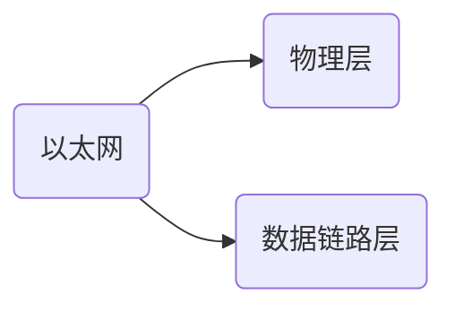
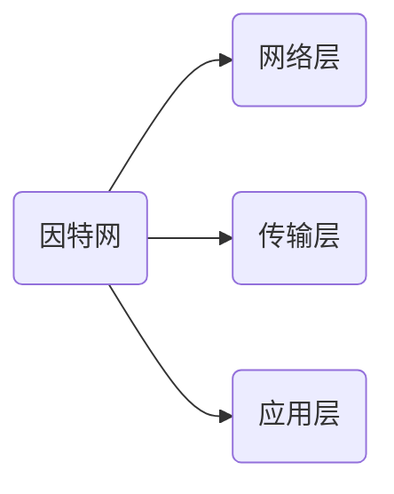

[TOC]
# 基础

## 网络的形成
[ip and mac ?](https://blog.csdn.net/hjding/article/details/80301389?spm=1001.2014.3001.5506)
两个网络：：
以太网，英特网
以太网1-2层
英特网3-5层 

## TCP五层架构

## 集线器<hub>
> 一个口收到的信号，原封不动的发送给所有其他的口，由其他的口上的设备自己决定是否接受信号。有点类似广播，但是比广播更纯粹。由于hub只是简单的转发，所以hub工作在物理层<L1>

### 网桥<bridge>
> 工作在数据链路层<L2>。以太网中，数据链路层地址就是mac地址，网桥与集线器<hub>的区别在于，网桥会过滤mac，只有目的mac地址匹配的数据才会发送到出口。一个网桥指的是一个输入到一个输出的桥接。

## 交换机<switch>
> ==早期的交换机==，其实可以看成多个网桥的集成设备，因此也工作在数据列路层。一个交换机口的输入到另一个交换机口的输出，可以认为是一个网桥。交换机中的mac table<表>，实际是为了网桥能工作而存在。
但是事情也不是绝对的，随着技术的发展，==也常常听到L3 switch<交换机>==,也就是说switch也可以包含routing<路由选择>功能。

## 路由器<router>
> 工作在网络层<L3>,基于IP地址做转发

### ip
> ==IP协议是不可靠无连接的==
#### 私网ip
> 局域网内使用的ip是私网ip，不能访问互联网的
#### 公网ip
> 公网ip是可以访问互联网的，所以私网访问互联网要做一下地址转换

### 为什么当初不直接把IP协议设计为可靠传输
<!-- > ==IP协议基于互联网协议，从你家到我家当然是走高速公路更快一点，互联网要求更快，更便宜，为了简化，为了提速== -->
> 要想真正回答这个问题，还得从1969年开始说起。
> 自从有了电话，电话的作为就是通信。传统的电信网的最主要的用途就是进行电话通信。普通的电话机很简单，没有什么智能，因此电信公司就不得不把电信网络设计的非常好，这种电信网可以保证用户通话时的通信质量。这点对使用非常简单的电话机的用户则是非常方便的。但电信公司为了建设能够确保传输质量的电信网则付出了巨大的代价。
> 数据的传送显然必须是非常可靠的。1969年美国国防部在设计ARPANET时有一个很重要的讨论内容就是：=="谁应当负责数据传输的可靠性？"==这时出现了两种对立的意见。
> ==一种意见是主张因当像电信网那样，由通信网络负责数据传输的可靠性(因为电信网的发展历史及其技术水平已经证明人们可以将网络设计得相当可靠)==
> ==但另一种意见则坚决主张由用户的主机负责数据传输的可靠性。这里最重要的理由是：这样可以是计算机网络便宜，灵活，同时还可以满足军事上的各种特殊需求==

> 下面用一个简单例子来说明这一问题
> 设主机A通过因特网向主机B传送文件，怎样才能实现文件数据的可靠传输？
>按照电信网的思路，就是设法(这需要花费相当多的钱)将不可靠的因特网做成为可靠的因特网。但设计计算机网络的人采用另一种思路，即设法实现端到端的可靠传输。
> 提出这种思路的人认为，计算机网络和电信网的一个重要区别就是终端设备的性能差别很大。==电信网的终端是非常简单的，没有什么智能的电话机。因此电信网的不可靠必然会严重影响人们利用电话的通信。但计算机网络的终端是很多智能的主机。==这样就使得计算机网络和电信网有两个重要的区别。==第一，即使传送数据的因特网有一些缺陷(如造成比特差错或分组丢失)，但具有很多智能的终端主机仍然有办法实现可靠的数据传输(例如，能够及时发现差错并通知发送方重传刚才的出错的数据)。第二，即使网络可以实现100%地无差错传输，端到端的数据传输仍然有可能出现差错。==

>> 互联网采用的设计思路是这样的：网络层向上只提供简单灵活的，无连接的，尽最大努力交付的数据报服务。网络在发送的分组时不需要先建立连接，网络层不提供服务质量的承诺，也就是说，所传送的分组可能出错，丢失，重复和失序(即不按序到达终点)，当然也不保证分组交付的时限。由于传输网络不提供端到端的可靠传输服务，这就使网络中的路由器比较简单，且价格低廉(与电信网的交换机相比较)。如果主机(即端系统)中的进程之间的通信需要是可靠的，那么就有网络的主机中的运输层负责(包括差错处理，流量控制等)。采用这种设计思路的好处是：网络造价大大降低，运行方式灵活，能够适应多种应用。互联网能够发展到今日的规模，充分证明了当初采用这种设计思路的正确性！
[MTU](https://developer.aliyun.com/article/222535)

### ICMP<ping的包>
> ICMP协议所完成的功能就是<帮助ip协议发送控制消息>，ICMP属于网络层。
ICMP是TCP/IP协议族的一个子协议。不承载数据，不是用来传输应户数据的，是用来传递控制消息的，即：网络通不通，主机是否可达。
个人理解：：假设每个ip都是一个家庭，ICMP协议只是去敲一敲门，没人回应(超时，或者目标主机不存在)就认为家里没有人回答错误。
 
<!--- ### 能ping通tcp就一定能连接到吗
~~[能ping通tcp就一定通吗](https://www.ithome.com/0/641/433.htm)~~
走的路径不一样
路由器可以通过OSPF协议生成路由表，利用数据包里的IP地址去跟路由器表做匹配，选择最优路径后进行转发。
当路由表一个都匹配不上时会走默认网关。当匹配上多个的时候，会先看匹配长度，如果一样就看管理距离，还一样就看路由成本。如果连路径成本都一样，那等路径。如果路由开启了ECMP，那就可以同时利用这几条路径做传输。
ECMP可以提高链路带宽，同时利用五元组做哈希键进行路径选择，保证了同一条连接的数据包走同一条路径，减少了乱序的情况。
可以通过traceroute命令查看到链路上是否有用到ECMP情况。
开启了ECMP的网络链路中，TCP和ping命令可能走的路径不同，甚至同样是TCP，不同连接之间，走的路径也不同，因此出现了连接时好时坏的问题，实在是走投无路了，可以考虑下是不是和ECMP有关。
当然，遇到问题多怀疑自己，要相信绝大部分时候真的跟ECMP无关 --->

### 网关与路由器的区别
> 路由器是网关的一种，但网关不一定是路由器，路由器是网关的一种
它们的本质：：路由器是跨相同网络之间的传输，用来寻找最佳路径
网关是跨不同网络之间的传输，主要用来翻译不同网络之间的协议

## 网关<概念>
[网关-知乎](https://zhuanlan.zhihu.com/p/165142303)
> 网关又称网络连接器，协议转换器。网关在传输层上以实现网络互联，是最复杂的网络互联设备。网关是一种充当转换重任的计算机系统或则设备。使用在不同的通信协议，数据格式或语言，甚至体系结构完全不同的两种系统之间，网关是一个翻译器。与网桥只是简单地传达信息不同，网关对受到的信息要重新打包，以适应目的系统的需求，运行在应用层；
个人理解：：假设A计算机网关以下使用A语言，因特网使用B语言，C计算机使用C语言。A计算机要发送消息到C计算机，消息为<hello>，发送流程

### 端口
[端口-知乎](https://zhuanlan.zhihu.com/p/225777212)
[端口](https://www.cloudflare.com/zh-cn/learning/network-layer/what-is-a-computer-port/)
端口的范围：：0～65535
ping命令与端口？
> 端口是一个传输层第四层概念。只有传输控制协议(TCP)或用户数据报协议(UDP)之类的传输协议才能指示数据包应去哪个端口。通常，无法在网络层指示端口，这对网络进程没有影响，因为网络层协议几乎总是与传输层协议结合使用。但是，这确实会影响测试网络连通性，这是使用互联网控制消息协议(ICMP)数据包"ping"IP地址。ICMP是一种网络层协议，可以ping联网设备。但是无法ping特定端口
端口可以认为是设备与外界通讯交流的出口，如果把ip地址比做一间房子，端口就是出入这间房子的门。一次ip+端口的请求，是一次进程间的通讯。端口可以简单的视作为进程ID的影子，也就是说，如果仅有域名(ip)，是无法定位到一个进程的。
端口，一个间接层
为什么引入端口，而不直接使用进程ID
1. 作为客户端无法知道服务端对应进程的ID
2. 服务端对应进程重启后ID会改变
3. 一个网站的web进程ID是这个，另一个网站的可能有是另一个
>> 自然，原因有很多，以上只是随便列举了一些，而为了解决这些个问题，就引入了端口这一间接层。
任何计算机问题均可通过增加一个间接层来解决，但通常会带来另一个问题。<比如它会使得层次结构复杂化，交互效率下降等>
如果没有这个间接层，客户端要与服务端通讯，就要知道服务端对应进程的ID，也即是客户端是依赖于服务端的：：显然，这种模式对于web这种一个服务端对应大量客户端访问的情形是极不适应的，你都不知道有谁可能会访问你的网站！你根本无法告诉它们；
而有了端口这一间接层，对于web的情形，这种依赖被倒置了，客户端总是把请求发送到80(或443)端口，这些成为标准的一部分，并要求服务端反过来去适应，服务端去监听端口的通讯处理，变成了一种反向依赖
